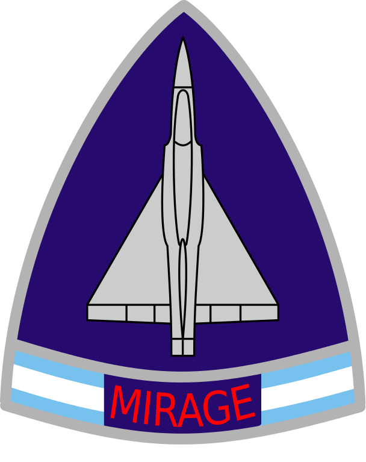
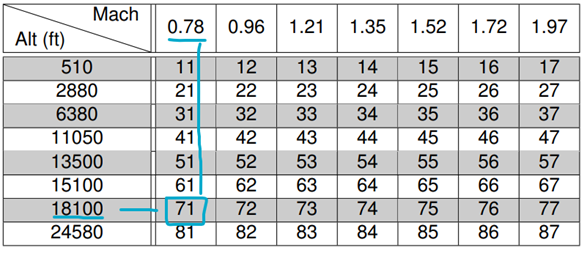

<h1 align="center"> 
  <br>
    </img>
  <br>
    Autopilot Design
  <br>
</h1>

<h2 align="center"> 
  A mirage III study
</h2>

<p align="center">

  

  

  
</p>

<p align="center">
  <a href="#about">About</a> •
  <a href="#installation">Installation</a> •
  <a href="#usage">Usage</a> •
  <a href="#credits">Credits</a> •
  <a href="#license">License</a>
</p>

## About
Our aircraft study to make an autopilot for the Mirage III is using the following point:


The code is made in python and showcase the following:
- [x] Aircraft state space model
- [x] Aircraft modes (Phugoid, Short period)
- [x] Aircraft stability analysis
- [x] Aircraft control analysis
- [x] Aircraft control design (feedback loops)

In order to find associated gains for the feedback loops, we use the following utility provided by **JP Nouaille**:
`sisopy31.py`

## Installation
To install the project, you need to have python 3.11.X and conda (or miniconda) installed on your computer.
Then, you can install the project with the following command:
```bash
conda install -c conda-forge slycot control
pip install -r requirements.txt # windows
pip3 install -r requirements.txt # linux
```

In case of any issue, there might be packages missing, you can install them with the following command:
```bash
pip install <package> # windows
pip3 install <package> # linux
```

Notice: we are using a legacy method `scipy.interpolate.interp1d` that might be removed any time. 
If you have any issue with this method, refer to the [documentation](https://docs.scipy.org/doc/scipy/reference/generated/scipy.interpolate.interp1d.html) and replace it with the new method.

## Usage
To use the project, you can run the following command:
```bash
py main.py #  windows
python3 main.py # linux
```

## Credits
This project was made during the IPSA course **Aircraft Flight Control** by:
- Julien Lubrano

With the sisotool provided by:
- Jean-Pierre Nouaille

This project uses custom styles for plots from:
- https://github.com/PhantHive/super-curves


